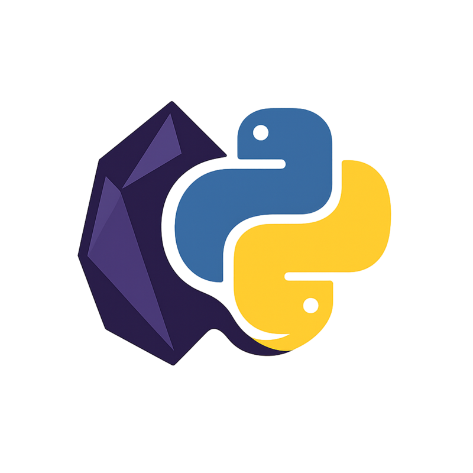

# 🐍 Python Bridge Plugin (for Obsidian)

<p align="center">
  
</p>

## **💥 Develop [Obsidian plugins](https://obsidian.md/plugins) in [Python](https://www.python.org/)!**

Yes, you read that right! With this plugin, you can **develop plugins for Obsidian using Python**. 🎉 This is likely the **first plugin** that lets you directly integrate **Python scripts** into Obsidian to interact with your notes, retrieve metadata, display notifications, configure scripts via the UI, and so much more!

> Ever needed to build plugins for Obsidian but felt like JavaScript wasn't your cup of tea?
> With **Obsidian Python Bridge**, you can now use your favorite language, **Python**, to create plugins for Obsidian. 🙌

<a id="tldr"></a>

## TL;DR (Too Long; Didn't Read)

- **What is this?** An Obsidian plugin that lets you run Python scripts to interact with your vault.
- **Why?** Makes extending Obsidian accessible if you prefer Python over JavaScript/TypeScript, especially for automation and data processing.
- **How?** The plugin runs your `.py` scripts. A companion Python library (`ObsidianPluginDevPythonToJS.py`) makes it easy to call Obsidian functions (get/modify notes, show notifications, use modals, etc.) from your script via a local HTTP connection.
- **Cool Features:** Cross-platform (Win/Mac/Linux), define UI settings for your scripts within Obsidian, trigger scripts from events, full vault access API, and more.
- **Basically:** Write Python, control Obsidian.

---

**Table of Contents**

- [TL;DR](#tldr)
- [Description](#description)
  - [Key Features](#key-features)
- [⚠️ Security Considerations](#security-considerations)
- [🌍 Internationalization](#internationalization)
- [Why this plugin? 🤔](#why-this-plugin)
  - [Feature Highlight: Graphical `input()` in Obsidian via Modals! 🚀](#graphical-input-feature)
  - [Feature Highlight: Script-Specific Settings in Obsidian UI! ⚙️](#script-settings-feature)
- [Example of basic usage](#basic-usage)
- [🚀 Future Features (roadmap)](#roadmap)
- [🛠️ Installation](#installation)
  - [Prerequisites](#prerequisites)
  - [From Obsidian Community Plugins (Recommended - Pending Approval)](#install-community)
  - [Manual Installation (Using Releases)](#install-manual)
- [⚙️ Configuration](#configuration)
- [🐍 Using the Python Library](#using-library)
- [💖 Support the Project](#support-the-project)
- [⭐ Show Your Support](#support-star)
- [🛠️ Contributing / Developer Setup](#contributing)
- [⭐ Check out my other plugins](#other-plugins)
- [License](#license)
- [🤔 FAQ (Frequently Asked Questions)](#faq)

---

<a id="security-considerations"></a>

## ⚠️ Security Considerations

**Security is a top priority** for the Obsidian Python Bridge plugin. The plugin includes multiple layers of protection to ensure safe script execution:

### 🔒 Built-in Security Features

- **Localhost-Only Communication**: The HTTP server listens **only on `127.0.0.1`** - never exposed to your network or the internet
- **Script Activation Controls**: Individual scripts can be **enabled or disabled** in the plugin settings. Disabled scripts are completely blocked from execution
- **Settings Discovery Protection**: Scripts marked as disabled are **skipped during settings discovery**, preventing unnecessary process execution
- **Security Warnings**: Clear warnings in the UI remind users to only run scripts they trust
- **Safe Script Structure**: The plugin enforces proper script structure with `define_settings()` and `_handle_cli_args()` to prevent unintended code execution during discovery

### 🛡️ Security Best Practices

1. **Only run scripts you trust** - review code before execution
2. **Keep scripts disabled when not in use** - use the activation toggles in settings
3. **Use the recommended script structure** - always include `define_settings([])` and `_handle_cli_args()` even for scripts without settings
4. **Monitor script activity** - check console logs for security-related messages
5. **Regular security audits** - periodically review which scripts are enabled and their permissions

### 📋 Security Logging

The plugin provides detailed logging for security events:

- Script execution attempts (success/failure)
- Settings discovery failures with specific error reasons
- Security warnings about potential unintended code execution
- Disabled script execution attempts

### 🔍 Audit Log Feature

The plugin includes a comprehensive **Audit Log** feature for security monitoring and debugging:

#### Features:

- **Optional Audit Logging**: Toggle to enable/disable audit logging in plugin settings
- **Custom Log File Path**: Optional custom path for audit log file (defaults to plugin directory)
- **Log Rotation**: Automatic log file rotation when size limits are reached
- **Configurable Limits**: Set maximum log file size (1-1000MB) and number of rotated files (1-50)

#### Logged Events:

- **Script Executions**: Timestamp, script name, trigger type (manual/auto-start/event), exit code, and error details
- **API Actions**: Timestamp, action name, response status, source script (when available), and error details
- **Security Events**: Failed execution attempts, settings discovery failures, and disabled script access attempts

#### Log Format:

All audit entries are logged in structured JSON format for easy parsing and analysis:

```json
{
  "timestamp": "2025-01-15T10:30:00.000Z",
  "type": "script_execution",
  "scriptName": "my_script.py",
  "triggerType": "manual",
  "status": "success",
  "exitCode": 0
}
```

#### Configuration:

Access audit log settings in **Settings > Community Plugins > Python Bridge > Audit Log**:

- Enable/disable audit logging
- Configure custom log file path (optional)
- Set maximum log file size (default: 10MB)
- Set maximum number of log files to keep (default: 5)

#### Security Benefits:

- **Monitoring**: Track all script executions and API interactions for security auditing
- **Debugging**: Detailed logs help troubleshoot script issues and API problems
- **Compliance**: Maintain audit trail for security and compliance requirements
- **Forensics**: Historical record of all plugin activities for incident analysis

### 🔐 Default Secure State

- **Scripts are disabled by default** - you must explicitly enable each script
- **Settings discovery is blocked for disabled scripts**
- **API calls are blocked during discovery mode** to prevent unintended operations

---

<a id="description"></a>

## Description

💻 Developing **Obsidian plugins** without diving into **JavaScript**? Yes, that's possible with **Obsidian Python Bridge**. This plugin is designed specifically to **execute Python scripts** within Obsidian, and it comes with a **built-in Python library** to make your life easier.

**Cross-Platform Compatibility & Robustness (Windows, macOS, Linux):** As of **May 2025**, the plugin uses a local HTTP server (listening only on `127.0.0.1` for security) instead of Unix sockets for communication. This makes the bridge **fully compatible with Windows, macOS, and Linux**! Furthermore, the plugin now **automatically detects your Python installation** (trying `py`, `python3`, and `python`) across all platforms, simplifying setup, especially on Windows. It also **performs checks on startup** to ensure Python is accessible and the required `requests` library is installed, **notifying you immediately** within Obsidian if there's an environment issue.

Some might think this plugin doesn't add much compared to running **external Python scripts**, but that's far from true. There are several key advantages:

#### What's easier with this plugin compared to external Python scripts:

- **Editing the current note**:
  Without the plugin, you'd need to manually copy the path of the open `.md` file, then run your script in a terminal, pasting the path. This process is tedious and far from user-friendly.

- **Detecting actions like note creation or deletion**:
  Yes, you can achieve this with an external Python script, but it requires constant monitoring, which adds complexity and clutters your code. With this plugin, such actions are handled more seamlessly.

- **Retrieving frontmatter content as a clean dictionary**:
  While possible with pure Python, parsing YAML and organizing the data properly takes time and lines of code. With this plugin, it's done in **a single line**. 🙌

In short, while some tasks are technically feasible without this plugin, they're cumbersome, and this plugin makes them **much simpler and more user-friendly**.

<a id="key-features"></a>

### Key Features (What external Python scripts **cannot** easily do, but this plugin can):

- **⚙️ Script-Specific Settings in Obsidian UI**: Define configuration options (like API keys, toggles, dropdowns, numbers) directly within your Python script. These settings automatically appear in the Obsidian "Python Bridge" settings tab, allowing users to configure your script's behavior without editing code. Your script can then easily retrieve the user-set values. This makes your Python scripts feel like native Obsidian plugins! (See highlight below)
- **🚀 Graphical `input()` in Obsidian via Modals**: Create **modal dialogs** in Obsidian to collect data from the user directly within the interface, similar to Python's `input()` but graphical. (See highlight below)
- **⌨️ Dynamic Commands & Shortcuts**: Automatically creates Obsidian commands for each executable Python script, allowing you to assign **keyboard shortcuts** directly to your favorite scripts.
- **⏯️ Script Activation Control**: Enable or disable individual scripts directly from the plugin settings, preventing accidental execution.

* **⏱️ Auto-Start Scripts on Launch**: Configure specific scripts to run automatically when Obsidian starts, optionally after a specified delay (useful for letting Obsidian load fully).

- **🔔 Native Obsidian Notifications**: Display notifications directly within Obsidian, making it more integrated and fluid compared to terminal outputs.
- **📝 Access/Modify Active Note & Selection**: Easily get content (as a single string or list of lines), frontmatter, path, or title of the currently open note, and get or replace selected text in the editor. Get basic editor context (cursor position, line count).
- **🛠️ **Advanced Editor Operations\*\*: Fine-grained editor control with methods like `setCursor`, `getLine`, `setLine`, `replaceRange`, and `scrollIntoView` for precise text manipulation and navigation.
- **📂 Vault Interaction & File Management**: Get the vault path, list all note paths (relative or absolute), open specific notes, read/modify any note's content or frontmatter (by path). **Create, check existence, rename, delete notes and folders. List folder contents.** Get outgoing links from a note.
- **🔗 Backlink Retrieval**: Get incoming links (backlinks) for a specific note. Optionally uses the [Backlink Cache plugin](https://github.com/mnaoumov/obsidian-backlink-cache) for significantly improved performance in large vaults if installed.
- **🏷️ Tag Management**: Retrieve all unique tags from your vault using `get_all_tags()`.
- **⚡ Command Execution**: Execute any Obsidian command by its ID using `run_obsidian_command()`.

* **👂 Event Listening**: Allow Python scripts to react to Obsidian events (like note modification, deletion, rename, etc.) by registering listeners.

- **ℹ️ Obsidian Context**: Get the current Obsidian language setting, vault name, and theme mode (light/dark).
- **🎨 Theme Control**: Programmatically set Obsidian to light mode, dark mode, or toggle the current theme.
- **🛡️ Environment Checks & Guidance**: Automatically checks for Python and required libraries (`requests`, `PyYAML`) on startup and provides clear notifications if something is missing.
- **💻 Cross-Platform**: Works reliably on Windows, macOS, and Linux thanks to HTTP communication and robust Python detection.
- **🌐 Internationalized Interface**: Plugin UI (settings, commands, notices) available in multiple languages. (Note: Full Right-to-Left (RTL) layout support for languages like Arabic, Persian, Urdu is planned but not yet fully implemented - see [Issue #25](https://github.com/mathe00/obsidian-plugin-python-bridge/issues/25)).

Thanks to the **Python library** (`ObsidianPluginDevPythonToJS.py`) provided with this plugin, you can write ultra-minimalist scripts to interact with Obsidian. **No need to deal with JSON** or manage complex API calls—everything is neatly wrapped for you. 🤖 (Note: The Python library requires the `requests` package, and `PyYAML` for some frontmatter property management functions). By default, the plugin automatically configures the environment so your scripts can directly `import ObsidianPluginDevPythonToJS` without needing to copy the library file.

👉 **For detailed instructions on how to use the Python library and its functions, including the new settings feature, please refer to the [Python Client Library Documentation](PYTHON_LIBRARY_DOCS.md).**

> **Note**: I'm **not a developer**, I just have solid experience with **Python**, and I get by with that. I know **nothing about JS**. This plugin was made **entirely with the help of AI assistants** (shoutout to **ChatGPT 4o**, **ChatGPT o1-preview**, and **Gemini 2.5 Pro** 😉). So, the code might be a bit rough around the edges, but it **works**. That's all that matters, right?

<a id="internationalization"></a>

## 🌍 Internationalization

This plugin aims to be accessible globally! The user interface (settings, commands, notices) is available in multiple languages.

- **Automatic Detection:** The plugin automatically follows Obsidian's configured language setting for the user interface. _(Note: Previous versions included manual language override, but this was removed to comply with Obsidian's community plugin guidelines which favor maximum simplicity (KISS principle). The automatic detection provides the best experience for most users while maintaining plugin store compatibility.)_
- **Supported Languages (+30):**
  - 🇬🇧/🇺🇸 English (en)
  - 🇫🇷 French (fr)
  - 🇪🇸 Spanish (es)
  - 🇩🇪 German (de)
  - 🇨🇳 Chinese - Simplified (zh)
  - 🇸🇦 Arabic (ar)
  - 🇧🇷/🇵🇹 Portuguese (pt)
  - 🇷🇺 Russian (ru)
  - 🇯🇵 Japanese (ja)
  - 🇮🇳 Hindi (hi)
  - 🇰🇷 Korean (ko)
  - 🇮🇹 Italian (it)
  - 🇹🇷 Turkish (tr)
  - 🇮🇩 Indonesian (id)
  - 🇵🇱 Polish (pl)
  - 🇮🇳 Bengali (bn)
  - 🇵🇰/🇮🇳 Urdu (ur)
  - 🇻🇳 Vietnamese (vi)
  - 🇹🇭 Thai (th)
  - 🇵🇭 Filipino (fil)
  - 🇮🇷/🇦🇫/🇹🇯 Persian (Farsi) (fa)
  - 🇲🇾/🇧🇳/🇸🇬 Malay (ms)
  - 🇳🇱/🇧🇪 Dutch (nl)
  - 🇺🇦 Ukrainian (uk)
  - 🇬🇷 Greek (el)
  - 🇸🇪 Swedish (sv) _(representing Scandinavian)_
  - 🇫🇮 Finnish (fi)
  - 🇭🇺 Hungarian (hu)
  - 🇷🇴 Romanian (ro)
  - 🇨🇿 Czech (cs)
  - 🌍 Swahili (sw)
  - 🌍 Hausa (ha)
  - 🇳🇬 Yoruba (yo)
  - 🇳🇬 Igbo (ig)
  - 🇹🇼/🇭🇰 Chinese - Traditional (zht)

*(Phew! That's quite a list. If your language is *still* missing, feel free to open an issue or pull request, but I think we've covered a good chunk of the planet now! 😄 Full Right-to-Left (RTL) layout support is planned, track progress at [Issue #25](https://github.com/mathe00/obsidian-plugin-python-bridge/issues/25).)*

<a id="why-this-plugin"></a>

## Why this plugin? 🤔

I get it. Why add a layer between **Python** and **Obsidian** when everything can already be done in **JavaScript**?

Because, honestly, I **prefer Python**. And if I can write code faster and more efficiently with **Python**, without having to learn a whole new ecosystem (JavaScript/TypeScript), then why not?

**Obsidian Python Bridge** was created for people like me who prefer coding in **Python** and want to do things **quickly and effectively** in Obsidian. Sure, there are probably more "clean" or "optimized" ways to do this, but as long as it **works** and I understand what I'm doing, I'm happy. 😎

<a id="graphical-input-feature"></a>

### **Feature Highlight: Graphical `input()` in Obsidian via Modals!** 🚀

As of **October 2, 2024**, the **Obsidian Python Bridge** plugin allows you to create **graphical input modals** in Obsidian! This feature is similar to Python's native `input()` function but integrated into the Obsidian interface. Instead of inputting data through the terminal, you can now prompt users with **interactive pop-ups** directly inside Obsidian for text, numbers, booleans, dates, and more.

This feature opens up a wide range of possibilities, from collecting user data dynamically to creating more interactive scripts and workflows.

Here's a quick example to demonstrate how you can use this feature:

```python
# Import the Python-Obsidian bridge module
# Make sure 'requests' is installed: pip install requests
from ObsidianPluginDevPythonToJS import ObsidianPluginDevPythonToJS, ObsidianCommError, define_settings, _handle_cli_args
import sys # Import sys to print errors to stderr
import os
import json

# --- Event Check ---
event_name_from_env = os.environ.get("OBSIDIAN_EVENT_NAME")
if event_name_from_env:
    print(f"Event triggered: {event_name_from_env}. Exiting example.")
    sys.exit(0)

# --- Settings Definition & Discovery Handling ---
# Recommended even for scripts without settings
MY_SETTINGS: list = []
define_settings(MY_SETTINGS)
_handle_cli_args() # Handles --get-settings-json and exits if found

# --- Main Script Logic ---
if __name__ == "__main__":
    try:
        # Create an instance of the class (uses default/env port)
        obsidian = ObsidianPluginDevPythonToJS()

        # Request text input from the user
        response = obsidian.request_user_input(
            script_name="Text Input Example",
            input_type="text",
            message="Please enter your name:"
        )

        # Send a notification with the user's input
        if response is not None: # Check if user cancelled
            obsidian.show_notification(content=f"Hello {response}!")
        else:
            obsidian.show_notification(content="Input cancelled by user.")

    except ObsidianCommError as e:
        print(f"Error communicating with Obsidian: {e}", file=sys.stderr)
    except Exception as e:
        print(f"An unexpected error occurred: {e}", file=sys.stderr)

```

In this example, the script opens a **modal dialog** in Obsidian where the user can enter their name. After the user submits their input, a notification pops up displaying the entered text.

Here's an example of what the **modal** looks like:


As you can see, it's incredibly easy to set up and integrate into your Obsidian workflows.

<a id="script-settings-feature"></a>

### **Feature Highlight: Script-Specific Settings in Obsidian UI!** ⚙️

Tired of hardcoding API keys or configuration values in your scripts? Now you don't have to!

With the latest update, you can **define settings directly within your Python script**. Simply import the `define_settings` helper, create a list describing your settings (like text fields, toggles, dropdowns, number inputs), and register them.

> **Important Note on Script Structure:** For settings discovery to work reliably and to prevent unintended code execution during plugin startup or settings refresh, it is **strongly recommended** to include `define_settings([])` (even with an empty list if your script has no settings) followed by `_handle_cli_args()` at the beginning of **all** your Python scripts. This ensures your script exits cleanly when the plugin checks for settings. See the [Python Client Library Documentation](PYTHON_LIBRARY_DOCS.md) for details on the recommended script structure.

```python
# Example snippet from your script
import sys
import os
from ObsidianPluginDevPythonToJS import define_settings, _handle_cli_args, ObsidianPluginDevPythonToJS

# --- Event Check (Recommended) ---
# ...

# --- Settings Definition & Discovery Handling (Recommended) ---
MY_SETTINGS = [
    { "key": "api_key", "type": "text", "label": "API Key", "default": "" },
    { "key": "enabled", "type": "toggle", "label": "Enable Feature", "default": True }
]
define_settings(MY_SETTINGS)
_handle_cli_args() # Handles discovery request from Obsidian and exits

# --- Main Script Logic ---
if __name__ == "__main__" and not os.environ.get("OBSIDIAN_EVENT_NAME"):
    obsidian = ObsidianPluginDevPythonToJS()
    settings = obsidian.get_script_settings()
    api_key = settings.get("api_key")
    feature_enabled = settings.get("enabled")
    # ... use settings ...
```

The **Obsidian Python Bridge** plugin will automatically **discover** these definitions and **display them in its settings tab** under a section for your script. Users can then configure these settings directly in the Obsidian interface, just like any other plugin!

Your script can then easily fetch the current values set by the user using the `obsidian.get_script_settings()` method. This makes your scripts much more flexible, user-friendly, and truly integrated into Obsidian. Check the [Python Client Library Documentation](PYTHON_LIBRARY_DOCS.md) for full details!

<a id="basic-usage"></a>

## Example of basic usage

This example shows basic interaction without script-specific settings. See the highlights above and the [Python Client Library Documentation](PYTHON_LIBRARY_DOCS.md) for examples using modals and settings. Remember to include the recommended structure with `define_settings` and `_handle_cli_args` as shown above for best results.

```python
# Import the Python-Obsidian bridge module
# Make sure 'requests' is installed: pip install requests
import sys
import os
import json
from ObsidianPluginDevPythonToJS import (
    ObsidianPluginDevPythonToJS, ObsidianCommError,
    define_settings, _handle_cli_args
)

# --- Event Check ---
event_name_from_env = os.environ.get("OBSIDIAN_EVENT_NAME")
if event_name_from_env:
    print(f"Event triggered: {event_name_from_env}. Exiting basic example.")
    sys.exit(0)

# --- Settings Definition & Discovery Handling (Recommended) ---
MY_SETTINGS: list = [] # No settings for this basic example
define_settings(MY_SETTINGS)
_handle_cli_args() # Handles --get-settings-json and exits if found

# --- Main Script Logic ---
if __name__ == "__main__":
    try:
        # Create an instance of the class (uses default/env port)
        obsidian = ObsidianPluginDevPythonToJS()

        # Test sending a notification
        obsidian.show_notification(content="Test notification: show_notification function", duration=5000)

        # Test retrieving the content of the active note (as string)
        note_content = obsidian.get_active_note_content(return_format="string") # Explicitly string
        if note_content is not None:
            obsidian.show_notification(content=f"Note content: {note_content[:50]}...", duration=5000)  # Show the first 50 characters
        else:
            obsidian.show_notification(content="No active note found.", duration=3000)

        # Retrieving the absolute path of the active note
        absolute_path = obsidian.get_active_note_absolute_path()
        obsidian.show_notification(content=f"Absolute path: {absolute_path}", duration=5000)

        # Retrieving the relative path of the active note
        relative_path = obsidian.get_active_note_relative_path()
        obsidian.show_notification(content=f"Relative path: {relative_path}", duration=5000)

        # Retrieving the title of the active note
        title = obsidian.get_active_note_title()
        obsidian.show_notification(content=f"Title: {title}", duration=5000)

        # Retrieving the absolute path of the current vault
        vault_path = obsidian.get_current_vault_absolute_path()
        obsidian.show_notification(content=f"Vault path: {vault_path}", duration=5000)

        # Retrieving the frontmatter of the active note
        frontmatter = obsidian.get_active_note_frontmatter()
        obsidian.show_notification(content=f"Frontmatter: {frontmatter}", duration=5000)

        # Retrieving all note paths (relative)
        all_relative = obsidian.get_all_note_paths(absolute=False)
        obsidian.show_notification(content=f"Found {len(all_relative)} relative paths.", duration=3000)


    except ObsidianCommError as e:
        print(f"Error communicating with Obsidian: {e}", file=sys.stderr)
    except Exception as e:
        print(f"An unexpected error occurred: {e}", file=sys.stderr)

```

And here's a screenshot showing the results of the above code executed in the Obsidian environment:


In just a **few lines**, you can interact with your Obsidian vault, display notifications, and manipulate note metadata effectively and easily.

<a id="roadmap"></a>

## 🚀 Future Features (roadmap)

### 🔥 High Priority

- ~~🛠️ **Advanced Editor Operations**: Implement reliable methods for finer editor control (e.g., `setCursor`, `getLine`, `setLine`, `replaceRange`, `scrollIntoView`). _(Note: Initial attempts faced persistent difficulties in reliably accessing the editor context at the right time, despite significant effort. Added back to roadmap for future investigation.)_~~ ✅ **COMPLETED**

### 🔧 Medium Priority

- 🔐 **Enhanced Security Features**: Script sandboxing, digital signature verification for scripts, execution time limits and resource quotas.
- ⚡ **Performance Optimizations**: Caching mechanisms for frequent API calls, lazy loading for large vault operations, connection pooling.
- 🔌 **Extended API Capabilities**: File watching and real-time sync, advanced search and filtering, integration with popular Obsidian plugins.
- 🛠️ **Developer Experience**: Python script debugging interface, script templates and scaffolding, integrated testing framework.
- 📊 **Analytics & Monitoring**: Script usage statistics, performance metrics dashboard, error tracking and reporting.
- 🌐 **Enhanced Integration**: WebSocket support for real-time communication, support for async/await patterns in Python, batch processing capabilities.

### 📥 Status

- 📥 **Plugin Submission**: The plugin (v2.0.0) has been submitted to the Obsidian Community Plugin list and is currently awaiting review and approval by the Obsidian team. The review process can take several months - you can track the submission status at [obsidian-releases/pull/6315](https://github.com/obsidianmd/obsidian-releases/pull/6315). Until then, manual installation is required.

<a id="installation"></a>

## 🛠️ Installation

<a id="prerequisites"></a>

### Prerequisites

Before installing the plugin, please ensure you have the following installed on your system:

1.  **Python 3.x**: Make sure Python is installed and, crucially, that its executable (`python`, `python3`, or `py` on Windows) is accessible via your system's **PATH environment variable**. The plugin will try to find it automatically.
    - **Alternative with `uv`:** As of version X.Y.Z (remplacez par la future version), the plugin can also detect and use [**`uv`**](https://github.com/astral-sh/uv) if it's installed and in your PATH. If `uv` is found, it will be preferred for running scripts. This allows you to manage Python versions and dependencies (like `requests` and `PyYAML`) within a `uv` virtual environment for your scripts folder. You are responsible for setting up your `uv` environment (e.g., `uv venv`, `uv pip install requests PyYAML`). The plugin will execute scripts via `uv run your_script.py` or `uv run python -B your_script.py` (if cache is disabled).
2.  **Python `requests` Library**: This plugin requires the `requests` library for HTTP communication. Install it using pip:
    ```bash
    pip install requests
    ```
    or if you use `python3` explicitly:
    ```bash
    python3 -m pip install requests
    ```
    _(The plugin will check for Python and `requests` on startup and notify you if either is missing.)_
3.  **Python `PyYAML` Library (Optional)**: Only needed if you use the `manage_properties_key` or `manage_properties_value` functions from the client library. Install via pip if needed:
    ```bash
    pip install PyYAML
    # or
    python3 -m pip install PyYAML
    ```

<a id="install-community"></a>

### From Obsidian Community Plugins (Recommended - Pending Approval)

> **Status:** The plugin (v2.0.0) has been submitted to the Obsidian Community Plugin list and is currently awaiting review and approval by the Obsidian team.

Once approved:

1.  Open Obsidian **Settings**.
2.  Go to **Community plugins**.
3.  Ensure **Safe mode** is **off**.
4.  Click **Browse** community plugins.
5.  Search for "**Python Bridge**".
6.  Click **Install**.
7.  Once installed, click **Enable**.
8.  Proceed to the [Configuration](#configuration) section below.

<a id="install-manual"></a>

### Manual Installation (Using Releases)

If the plugin is not yet available in the Community Plugins list or you prefer manual installation:

1.  Go to the [**Releases page**](https://github.com/mathe00/obsidian-plugin-python-bridge/releases) of this repository.
2.  Download the latest release archive (e.g., `obsidian-python-bridge-X.Y.Z.zip`). **Do not** download the source code zip.
3.  Extract the contents of the downloaded zip file. You should have `main.js`, `manifest.json`, and potentially `styles.css`.
4.  Navigate to your Obsidian vault's configuration folder: `<your-vault>/.obsidian/plugins/`.
5.  Create a new folder named `obsidian-python-bridge`.
6.  Copy the extracted `main.js`, `manifest.json`, and `styles.css` (if present) into the newly created `obsidian-python-bridge` folder.
7.  **Restart Obsidian**.
8.  Go to **Settings** > **Community plugins**, find "Python Bridge" in the list of installed plugins (you might need to disable Safe Mode if it's your first time), and **enable it**.
9.  Proceed to the [Configuration](#configuration) section.

<a id="configuration"></a>

## ⚙️ Configuration

After installing and enabling the plugin:

1.  Go to **Settings** > **Community plugins** > **Python Bridge** (click the gear icon).
2.  **⚠️ Security Warning**: Read the prominent security warning at the top of the settings page. This warning reminds you that the plugin executes Python scripts and you should only run scripts you trust and review.
3.  **Plugin Language**: The plugin automatically follows Obsidian's language setting for the user interface. _(Manual language override has been removed to comply with Obsidian community plugin guidelines favoring simplicity.)_
4.  Set the **Path to Python Scripts Folder**: Enter the **absolute path** or **vault-relative path** to the folder where you will store your Python scripts. This is where the plugin will look for `.py` files to run and discover settings from.
5.  **(Optional) Python Executable Path**: If the automatic detection of Python (or `uv`) fails, or if you need to use a specific Python/uv executable not in your default PATH, you can provide an **absolute path** to it here. Leave this field empty to use automatic detection (tries `uv`, then `py`, `python3`, `python`). _Changing this setting may require a plugin reload or Obsidian restart to take full effect for all operations._
6.  Ensure the **HTTP Port** is set correctly (default is `27123`, 0 allows dynamic assignment).
    - **Note on Multiple Vaults:** If you use this plugin in multiple Obsidian vaults simultaneously, you **must** configure a **unique HTTP Port** for each vault in its respective plugin settings to avoid conflicts. Your Python scripts will then need to target the correct port for the intended vault (the plugin sets the `OBSIDIAN_HTTP_PORT` environment variable to the _actual_ listening port when running scripts).
7.  **🔒 Script-Specific Settings & Activation**:
    - Click the **"Refresh Definitions"** button to discover scripts and their settings.
    - Each discovered script appears in its own section with:
      - **Activation Toggle**: **Enable/disable individual scripts**. Scripts are **disabled by default** for security. Disabled scripts cannot be executed and are skipped during settings discovery.
      - **Settings Configuration**: If the script defines settings using `define_settings()`, they appear here for user configuration.
      - **Auto-start Options**: Configure enabled scripts to run automatically on Obsidian startup, optionally with a delay.
    - **Security Note**: When you try to enable a script for the first time, you may see a confirmation modal reminding you to review the script code before enabling it.
8.  **(New!) Performance Tip**: Note the recommendation regarding the [Backlink Cache plugin](https://github.com/mnaoumov/obsidian-backlink-cache) if you plan to use the `get_backlinks` feature frequently in large vaults.
9.  **(New & Recommended!) Auto-set PYTHONPATH for Library**: This setting is **enabled by default**. It allows your Python scripts to directly import the bridge's Python library (`ObsidianPluginDevPythonToJS.py`) without needing to copy the file into your scripts folder. If you disable this, you'll need to manage library access manually (see "Using the Python Library" below).

<a id="using-library"></a>

## 🐍 Using the Python Library (`ObsidianPluginDevPythonToJS.py`)

- **Recommended (Default Behavior):** The plugin includes a setting called "**Auto-set PYTHONPATH for Library**" (found under "Python Bridge" in Obsidian's Community Plugin settings). This option is **enabled by default**. When enabled, the plugin automatically makes the `ObsidianPluginDevPythonToJS.py` library (located within the plugin's installation directory) available to your Python scripts. You can then directly use `from ObsidianPluginDevPythonToJS import ...` in your scripts located in your configured "Python Scripts Folder" without any extra steps.
- **Alternative (If "Auto-set PYTHONPATH" is disabled):** If you choose to disable the "Auto-set PYTHONPATH for Library" option, you will then need to:
  - Download the `ObsidianPluginDevPythonToJS.py` file from this repository.
  - Place this `.py` file inside the "Python Scripts Folder" you configured in step 6.
  - Alternatively, you would need to manage Python's `sys.path` manually within each of your scripts to point to the location of the library file, which is more complex.

👉 **For detailed instructions on how to use the Python library and its functions, including the new settings feature, please refer to the [Python Client Library Documentation](PYTHON_LIBRARY_DOCS.md).**

<a id="support-the-project"></a>

## 💖 Support the Project

If you find this plugin valuable, especially if it saves you substantial time by letting you create Obsidian plugins in Python when you otherwise couldn't have (or wouldn't have wanted to) in JavaScript, please consider making a donation.

Developing and maintaining this bridge has involved a significant personal investment: **dozens of hours** tackling technical challenges and **substantial financial costs** related to AI assistance (API fees and subscriptions for literally thousands of requests) used extensively during development – all provided for free and largely for the benefit of the community, not just my own use.

Compared to the hours of work and potential frustration this plugin might save you, even a small contribution is greatly appreciated and goes a long way in helping to offset these development costs and support continued maintenance and future improvements.

I currently accept donations through:

**Bitcoin**  
`zpub6nL6JpeLNPiK44KpPbBxQc8emSar7ZsbvLf1vbQsYmUAaHNj289i9q2XtE4H5cYLiFCxWSpWP88HBf7F75n34998LDutyHkdzKBJYxyMDoQ`

**Ethereum**  
`0xe0b8007dca71940ab09a2e025f111216f0eb1c4e`

If you have any questions about donations or encounter any issues, please feel free to open a GitHub issue. I'm available to respond to donation-related questions just like any other issue or feedback.

<a id="support-star"></a>

## ⭐ Show Your Support

If you find this plugin useful or interesting, feel free to give it a **star** on GitHub!
Or if you'd rather not, you can also drop by and say **hello** or provide feedback through **issues**.
I'm open to all kinds of feedback, advice, and encouragements! 😊

<a id="contributing"></a>

## 🛠️ Contributing / Developer Setup

Contributions are welcome! If you're a developer and see ways to improve this plugin, feel free to submit issues or pull requests.

**Setup for Development:**

If you want to modify the plugin's TypeScript code or contribute:

1.  **Clone the repository**:
    ```bash
    git clone https://github.com/mathe00/obsidian-plugin-python-bridge.git
    ```
2.  **Navigate into the project folder**:
    ```bash
    cd obsidian-plugin-python-bridge/
    ```
3.  **Install dependencies**:
    ```bash
    npm install
    ```
4.  **Build the project**:
    ```bash
    npm run build
    ```
    Or run `npm run dev` to automatically rebuild on file changes.
5.  **Install in Obsidian for Testing**:
    - Copy the generated `main.js`, `manifest.json`, and `styles.css` (if it exists) into a dedicated folder within your vault's plugin directory (e.g., `<your-vault>/.obsidian/plugins/obsidian-python-bridge-dev/`).
    - Enable the plugin in Obsidian.

As for me, as long as it works in **Python**, I'm satisfied. But if you see how to optimize or make the code **cleaner**, feel free to **submit your pull requests**!

I'm not an expert in **JavaScript** or **TypeScript**, but I'm learning and doing my best with the help of **AI assistants**. If you think this project is an odd mix of languages, I get it. But for me, it's a way to **create quickly** and **understand what I'm doing**.

<a id="other-plugins"></a>

## ⭐ Check out my other plugins

Feel free to check out my other plugins for Obsidian on my GitHub, like the **[Better Auto Linker](https://github.com/mathe00/obsidian-better-auto-linker-plugin)** or the **[Interactive Progress Bar Plugin](https://github.com/mathe00/obsidian-progress-bar-plugin)**. As always, they're **a bit rough** around the edges, but **they work**, and that's what matters in the end, right? 😅

<a id="license"></a>

## License

I've chosen the [MIT License](https://choosealicense.com/licenses/mit/) for this project because I believe in **freedom and open-source**.
If anyone has opinions on other licenses, feel free to share! I've been creating repos for about a week, so I'm still figuring things out as I go along. 😊

---

<a id="faq"></a>

## 🤔 FAQ (Frequently Asked Questions)

Here are answers to some common questions and concerns about the Obsidian Python Bridge:

**Q: Why use Python when Obsidian plugins are built with JavaScript/TypeScript? Isn't this just adding complexity?**

**A:** Great question! This bridge isn't meant to replace traditional TS/JS plugin development, especially for complex UI integrations. Its main goals are:

- **Accessibility for Python Users:** Many people know Python for scripting, data science, or backend work but aren't familiar with the JS/TS web development ecosystem. This bridge lowers the barrier for them to automate and extend _their own_ Obsidian vaults using a language they already know well.
- **Rapid Scripting & Automation:** For tasks involving note processing, interacting with external APIs, or personal workflow automation, writing a quick Python script using this bridge can often be much faster _for a Python user_ than setting up a full TS plugin environment.
- **Leveraging Python's Ecosystem:** Easily use powerful Python libraries (`requests`, `pandas`, data analysis tools, etc.) to process information and interact with your Obsidian notes.
- **Focus on Logic:** Ideal for automating tasks "behind the scenes" without needing to build custom UI elements in Obsidian.

It's about providing a **familiar and efficient alternative** for specific use cases and user groups.

**Q: Is this secure? Isn't running Python scripts a security risk or a "backdoor"?**

**A:** Security is a valid concern when running external code. Here's how the bridge addresses it:

- **Localhost Only:** The communication bridge (HTTP server) listens **only on `127.0.0.1` (your local machine)**. It's not exposed to your network or the internet.
- **User Control:** _You_ control everything. You specify the _only_ folder where executable Python scripts are located. You choose which scripts to run via commands or shortcuts. You can enable/disable individual scripts in the settings. You configure any auto-start behavior.
- **The Real Risk = The Script Itself:** The bridge _executes_ Python scripts you provide. The security fundamentally relies on **you trusting the scripts you choose to run**. This is the same risk as running _any_ script downloaded from the internet or even using complex community plugins that might have extensive permissions.
- **No Hidden Access:** It's not a "backdoor" in the sense of hidden, unauthorized access. It's a tool that runs code _you_ provide, at _your_ explicit request (or configuration).
- **Plugin Warnings:** The plugin settings include an explicit security warning reminding users of this responsibility.

**Q: How can a Python "plugin" be accepted into the official Obsidian store? Do I need to bundle the bridge?**

**A:** You don't submit your Python _scripts_ to the Obsidian store. What gets submitted (and is currently pending review) is the **"Obsidian Python Bridge" plugin itself**. This core plugin _is_ written in TypeScript/JavaScript and uses the standard Obsidian API.

- Once the **Bridge plugin** is installed (either manually or from the community store when approved), _you_ simply place your `.py` scripts in the folder you configured.
- You **don't** bundle the bridge with your scripts. Users install the bridge once, then add any Python scripts they want.

**Q: Does this convert Python to JavaScript? Can I use Python libraries?**

**A:** No, there's **no code conversion**. Your Python script runs as pure Python using your system's Python interpreter in a separate process. That's the whole point! You can use standard Python syntax, libraries (`requests`, `pandas`, `numpy`, your own modules, etc.), and logic just like any other Python script. The bridge simply facilitates communication _between_ your running Python script and Obsidian.

**Q: The codebase was heavily AI-assisted. Is it reliable?**

**A:** Yes, I've been transparent about using AI extensively, primarily because I'm much stronger in Python than JS/TS, and English isn't my first language. It was the practical way to build this complex bridge.

- **Open Source:** The _entire_ codebase (TypeScript plugin and Python library) is open source on GitHub precisely so it can be reviewed, audited, and improved by the community.
- **Testing & Refinement:** While AI helped generate structure and boilerplate, the core logic, API interactions, and bug fixes involved significant manual testing and refinement (as seen in the commit history and recent fixes).
- **Community Review:** The submission to the official plugin store involves a code review process by the Obsidian team.
- **Contributions Welcome:** I absolutely welcome contributions, code reviews, and pull requests from experienced JS/TS developers to improve code quality, security, and robustness.

**Q: Why do my scripts need `define_settings` and `_handle_cli_args` even if they don't have settings?**

**A:** This is **strongly recommended** for reliable interaction with the plugin's settings discovery process. When the plugin looks for scripts that _might_ have settings, it runs them with `--get-settings-json`.

- `_handle_cli_args()` detects this flag and makes your script exit cleanly _before_ it tries to run its main logic or initialize the API client.
- If you _don't_ include this structure, your script might run unintended code during discovery. The library will block API calls in this "discovery mode" (raising an error), but using the helpers provides a cleaner exit and avoids these errors in the logs. It ensures the plugin knows your script doesn't define settings, rather than assuming discovery failed.

**Q: Can I use `uv` (from Astral) to manage Python environments and dependencies for my scripts?**

**A:** Yes! As of version 2.1.0, the Python Bridge plugin can detect if `uv` is installed and accessible in your system's PATH. If found, `uv` will be preferred over standard `python`/`python3` executables.

- **How it works:** The plugin will attempt to run your scripts using `uv run your_script.py`. If the "Disable Python Cache" setting is enabled, it will use `uv run python -B your_script.py` to pass the `-B` flag to the underlying Python interpreter managed by `uv`.
- **Your Responsibility:** You are responsible for setting up and managing your `uv` environment within your Python scripts folder. This typically involves:
  1.  Initializing a virtual environment: `uv venv` (in your scripts folder).
  2.  Activating it (for your terminal, not strictly needed for the plugin if `uv` is in PATH).
  3.  Installing necessary dependencies like `requests` (required) and `PyYAML` (optional, for property management) into the `uv` environment: `uv pip install requests PyYAML`.
- **Benefits:** Using `uv` can simplify dependency management and ensure your scripts run with a consistent Python version and package set, isolated from your global Python installation.
- **Detection:** The plugin checks for `uv --version` to confirm its availability.

**Q: Will there ever be mobile support for this plugin?**

**A:** **No, mobile support will never be implemented.** This decision is final and based on fundamental technical limitations:

**Why Mobile Support is Impossible:**

1. **OS Restrictions**: Mobile operating systems (iOS/Android) have strict sandboxing that prevents apps like Obsidian from executing external processes like Python interpreters. This is a core security feature that cannot be bypassed.

2. **No Inter-Process Communication**: The plugin relies on HTTP communication between Obsidian and Python processes. Mobile OSes explicitly block this type of inter-app communication for security reasons.

3. **Python Availability**: Even if communication were possible, there's no standard, accessible Python interpreter on mobile devices that could be leveraged by the plugin.

4. **Architecture Mismatch**: The entire plugin architecture is built around desktop OS capabilities (process spawning, localhost networking, file system access) that simply don't exist on mobile platforms.

**Why "Termux" or Similar Solutions Won't Work:**

- **Complex Setup**: Solutions like Termux (Android) would require extremely complex user setup and would still be blocked by Android's security restrictions.
- **Poor Experience**: Even if technically possible, the result would be unreliable, slow, and offer a terrible user experience.
- **Maintenance Nightmare**: Supporting such workarounds would create an unsustainable maintenance burden.

**The Bottom Line:**

This plugin is **desktop-only** by design and will remain so permanently. The technical barriers are not just difficult—they're fundamental to how mobile operating systems work. Any attempt to support mobile would compromise the plugin's reliability, security, and core functionality.

**Alternatives for Mobile Users:**

- Use Obsidian's built-in features and community plugins designed for mobile
- Sync your vault to a desktop computer where you can run Python scripts
- Consider web-based automation solutions that work within mobile browser constraints

This decision allows us to focus on making the desktop experience as robust and reliable as possible rather than attempting impossible mobile workarounds.

---

**Thanks to everyone** who takes the time to test, contribute, or even just read this README! Together, we can turn this plugin into something truly useful for the Obsidian community. 💪
